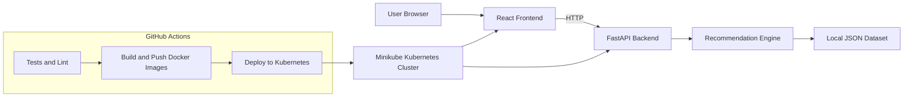

# BookBee DevOps Platform - Scalable Recommendation System

BookBee is a fully local, production-style full-stack platform that demonstrates recommendation logic, modern UI engineering, and complete DevOps delivery with CI/CD, Docker, Kubernetes, and Terraform.

## Project Overview

- Frontend: React + Vite application with genre reveal, recommendations, and history timeline.
- Backend: FastAPI service exposing recommendation APIs and observability endpoints.
- Recommendation Engine: Dedicated module (`recommender/`) using weighted scoring and de-duplication.
- Dataset: Local JSON with 100 books (no external API usage).
- DevOps: GitHub Actions pipeline, Docker images, Kubernetes deployment, Terraform IaC.

## Architecture Diagram



## Repository Structure

```text
bookbee-devops/
|- frontend/
|- backend/
|- recommender/
|- dataset/
|- docker-compose.yml
|- k8s/
|- terraform/
|- .github/workflows/
`- README.md
```

## Backend API

- `GET /health`: service health check
- `GET /metrics`: Prometheus-formatted metrics
- `GET /genre`: returns a random genre
- `GET /recommend/{genre}`: returns 3 to 5 weighted recommendations
- `GET /history`: returns in-memory recommendation history

## Recommendation Logic

- Randomized weighted selection based on rating and exploration factor
- De-duplication by title per response
- Bounded response size (minimum 3, maximum 5)
- Genre-indexed in-memory cache for fast lookup

## Local Development

### Prerequisites

- Python 3.12+
- Node.js 22+
- Docker Desktop
- Minikube + kubectl
- Terraform 1.6+

### Run backend locally

```bash
pip install -r backend/requirements.txt
uvicorn app.main:app --app-dir backend --host 0.0.0.0 --port 8000
```

### Run frontend locally

```bash
cd frontend
npm install
npm run dev
```

### Run tests and lint

```bash
pytest
ruff check backend recommender
cd frontend && npm run test
cd frontend && npm run lint
```

## Docker

### Build and run with Compose

```bash
docker compose up --build
```

- Frontend: `http://localhost:3000`
- Backend: `http://localhost:8000`

## Kubernetes (Minikube)

### Apply manifests

```bash
kubectl apply -f k8s/namespace.yaml
kubectl apply -f k8s/backend-deployment.yaml
kubectl apply -f k8s/backend-service.yaml
kubectl apply -f k8s/frontend-deployment.yaml
kubectl apply -f k8s/frontend-service.yaml
kubectl apply -f k8s/hpa.yaml
```

### Access services

```bash
minikube ip
```

- Frontend: `http://<MINIKUBE_IP>:30081`
- Backend: `http://<MINIKUBE_IP>:30080`

## Terraform IaC Usage

```bash
cd terraform
terraform init
terraform plan -var="dockerhub_username=<your-dockerhub-username>"
terraform apply -var="dockerhub_username=<your-dockerhub-username>"
```

Terraform provisions namespace, deployments, and services in Kubernetes.

## CI/CD Pipeline (GitHub Actions)

File: `.github/workflows/ci-cd.yml`

Pipeline stages:
1. Install dependencies
2. Run backend tests (`pytest`)
3. Run frontend tests (`vitest`)
4. Lint code (`ruff`, `eslint`)
5. Build Docker images
6. Push images to Docker Hub
7. Deploy to Kubernetes automatically on `main`

### Required GitHub Secrets

- `DOCKERHUB_USERNAME`
- `DOCKERHUB_TOKEN`
- `KUBECONFIG` (base64 or plaintext kubeconfig for runner)

## Git Strategy

- Branches: `main`, `develop`, and `feature/*`
- PR-first workflow is documented in `CONTRIBUTING.md`
- Conventional commit prefixes: `feat:`, `fix:`, `chore:`

## Screenshots

Place screenshots under `docs/screenshots/`.

- `docs/screenshots/ui-home.png`
- `docs/screenshots/history-view.png`
- `docs/screenshots/minikube-services.png`

## Commands Used

```bash
# Frontend
npm install
npm run dev
npm run test
npm run lint

# Backend
pip install -r backend/requirements.txt
uvicorn app.main:app --app-dir backend --host 0.0.0.0 --port 8000
pytest
ruff check backend recommender

# Containers and deployment
docker compose up --build
kubectl apply -f k8s/
terraform init && terraform apply
```
